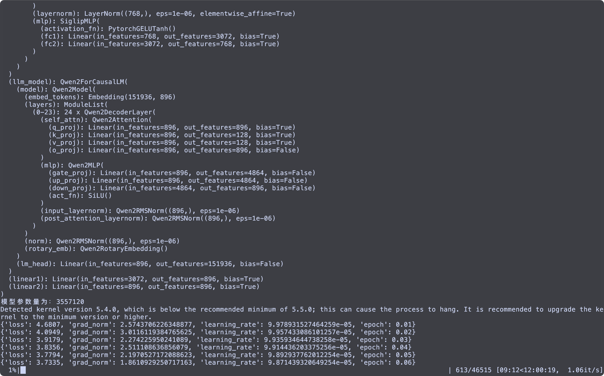

# Usage Instructions

## Downloading Models and Datasets

### Download Qwen2.5-0.5B and SigLIP

- **Qwen2.5-0.5B**:  
  [https://huggingface.co/Qwen/Qwen2.5-0.5B-Instruct](https://huggingface.co/Qwen/Qwen2.5-0.5B-Instruct)

- **SigLIP**:  
  The following lightweight version of SigLIP is used in this project. While it may offer lower performance compared to larger models, it trains faster and requires less GPU memory:  
  [https://huggingface.co/google/siglip-base-patch16-224](https://huggingface.co/google/siglip-base-patch16-224)

  Alternatively, a more performant but larger model can be used. Note that this version outputs image features of shape `(b, 729, dim)` and may require modification of the `image_pad_num` parameter. During image compression, the feature shape is reshaped to `(b, 729/9, dim*9)`:  
  [https://huggingface.co/google/siglip-so400m-patch14-384](https://huggingface.co/google/siglip-so400m-patch14-384)

### Download Datasets

1. **Pretraining Datasets**:
   - Image Data:  
     [https://huggingface.co/datasets/liuhaotian/LLaVA-CC3M-Pretrain-595K](https://huggingface.co/datasets/liuhaotian/LLaVA-CC3M-Pretrain-595K)
   - Chinese Text Data:  
     [https://huggingface.co/datasets/LinkSoul/Chinese-LLaVA-Vision-Instructions](https://huggingface.co/datasets/LinkSoul/Chinese-LLaVA-Vision-Instructions)

2. **SFT (Supervised Fine-Tuning) Datasets**:
   - Image Data:  
     [https://huggingface.co/datasets/jingyaogong/minimind-v_dataset](https://huggingface.co/datasets/jingyaogong/minimind-v_dataset)
   - Chinese Text Data:  
     [https://huggingface.co/datasets/LinkSoul/Chinese-LLaVA-Vision-Instructions](https://huggingface.co/datasets/LinkSoul/Chinese-LLaVA-Vision-Instructions)

## Training

### Direct Execution

- Pretraining:  
  ```bash
  python train.py
  ```

- SFT (Supervised Fine-Tuning):  
  ```bash
  python sft_train.py
  ```

### Using `torchrun`

- Pretraining:  
  ```bash
  torchrun --nproc_per_node=2 train.py
  ```

- SFT:  
  ```bash
  torchrun --nproc_per_node=2 sft_train.py
  ```

### Using DeepSpeed

- Pretraining:  
  ```bash
  deepspeed --include 'localhost:0,1' train.py
  ```

- SFT:  
  ```bash
  deepspeed --include 'localhost:0,1' sft_train.py
  ```

## Evaluation

To run evaluation:
```bash
python test.py
```

## Training screenshots

The following training is performed on a node with a single A40.

### Python



### DeepSpeed


